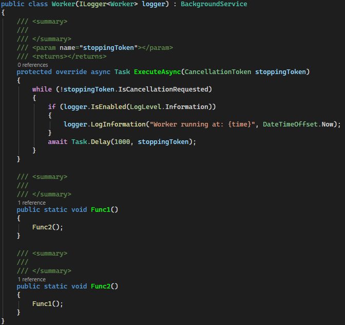
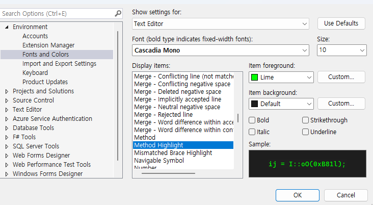

# MethodHighlighter

Highlights C# method declarations with a customizable color, making it easier to spot method definitions at a glance.

Unlike general syntax highlighters, MethodHighlighter only colorizes method **definitions** — not calls or references.

## Customization

You can change the highlight color via:
**Tools → Options → Environment → Fonts and Colors → Method Highlight**

